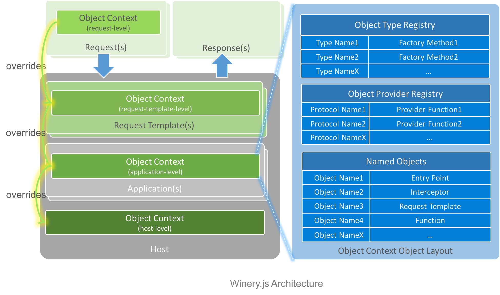

# Winery.js

Winery.js is a framework to enable services to run experiments along with serving production traffic on the same servers. Besides A/B testing, it supports experimentation at per-request level, which minimizes turnaround time when code evolves fast. Winery.js also provides a structure for creating applications declaratively, with the access to [Napa.js](https://github.com/Microsoft/napajs) capabilities, such as multi-threading, pluggable logging, metric, and etc. Before this work was branched out as an open source project, it has been used in Bing to empower feature experiments for machine learned models.

## Installation
```
npm install winery
```

## Quick Start

```js
const winery = require('winery');
const hub = winery.hub();
hub.register('winery/examples/playground', ['playground']);

const request = {
    "application": "playground",
    "entryPoint": "sort",
    "input": [12, 16, 1, 10, 2, 5, 0],
    "overrideObjects": [
        {
        "name": "comparator",
        "value": {
            "_type": "Function",
            "function": "function (a, b) { return a.toString() >= b.toString(); } "
        }
        }
    ]
};
    
hub.serve(request)
.then((response) => {
    console.log(response);
});

```
console  output:
```js
{ responseCode:0, output: [0, 1, 10, 12, 16, 2, 5] }
```

## Features
- Support request level dependency injection for rapid development
- Support request template level dependency injection for A/B testing
- Rich dependency injection capabilities: data, functions and behaviors
- Declarative application framework
- Flexible flow control: Entrypoint with stacked interceptors
- Integrated with Napa.js to support computation heavy scenarios
- Multi-tenancy with resource sharing among multiple applications
- Built-in instrumentation and monitoring support


## Overview

Winery.js was built based on the idea of dependency injection at multiple levels, thus its core is to encapsulate object creation and object retrieval behaviors with an overriding mechanism. White paper [Continuous modification: a process to build constantly evoling services](https://github.com/daiyip/continuous-modification) discussed this idea in details. 

In Winery.js' implementation, [**Object Context**](./docs/api/object-context.md) serves the purpose to capture these behaviors, whose instances are owned by multiple runtime entities with different lifetime and configurability. These object context objects work collaboratively to form an overriding chain among these entities.

These runtime entities are:
- [**Host**](./docs/api/host.md): a conceptually singleton object to host applications. Live long and is configurable at deployment time.
- [**Application**](./docs/api/application.md): multi-instance object that manages resources for request execution and serve user requests. Live long and is configurable at deployment time.
- [**Request Template**](.docs/api/request-template.md): multi-instance object that manages different parameters and resources for A/B testing. Live long and is configurable at runtime.
- [**Request**](./docs/api/request.md): multi-instance object that describes request from user. Live short and is configurable at runtime.




## Specification
- [Object Context](./docs/api/object-context.md)
  - [Overriding Rule](./docs/api/object-context.md#overriding-rule)
  - [Object Types](./docs/api/object-context.md#object-types)
  - [Object Providers](./docs/api/object-context.md#object-providers)
  - [Named Objects](./docs/api/object-context.md#named-objects)
- [Host](./docs/api/host.md)
  - [Application Registration](./docs/api/host.md#application-registration)
  - [Request Serving](./docs/api/host.md#request-serving)
- [Application](./docs/api/application.md)
  - [Request Execution](./docs/api/application.md#request-execution)
    - [Request Context](./docs/api/application.md#request-context)
    - [Interceptors](./docs/api/application.md#interceptors)
    - [Entry Points](./docs/api/application.md#entry-points)
  - [Application-level Resources](./docs/api/application.md#application-level-resources)
  - [Monitoring](./docs/api/application.md#monitoring)
- [Request Template](./docs/api/request-template.md)
  - [Template-level Resources](./docs/api/request-template.md#template-level-resources)
  - [Template Inheritance](./docs/api/request-template.md#template-inheritance)
  - [Examples](./docs/api/request-template.md#examples)
- [Request](./docs/api/request.md)
  - [Basic Fields](./docs/api/request.md#basic-fields)
  - [Override Fields](./docs/api/request.md#override-fields)
  - [Examples](./docs/api/request.md#examples)
- [Response](./docs/api/response.md)
  - [Basic Fields](./docs/api/response.md#basic-fields)
  - [Debug Information](./docs/api/response.md#debug-information)
  - [Performance Information](./docs/api/response.md#performance-information)
  - [Examples](./docs/api/response.md#examples)

# Contribute
You can contribute to Winery.js in following ways:

* [Report issues](https://github.com/Microsoft/wineryjs/issues) and help us verify fixes as they are checked in.
* Review the [source code changes](https://github.com/Microsoft/wineryjs/pulls).
* Contribute bug fixes.

This project has adopted the [Microsoft Open Source Code of Conduct](https://opensource.microsoft.com/codeofconduct/). For more information see the [Code of Conduct FAQ](https://opensource.microsoft.com/codeofconduct/faq/) or contact opencode@microsoft.com with any additional questions or comments.

# License
Copyright (c) Microsoft Corporation. All rights reserved.

Licensed under the [MIT](https://github.com/Microsoft/napajs/blob/master/LICENSE.txt) License.
