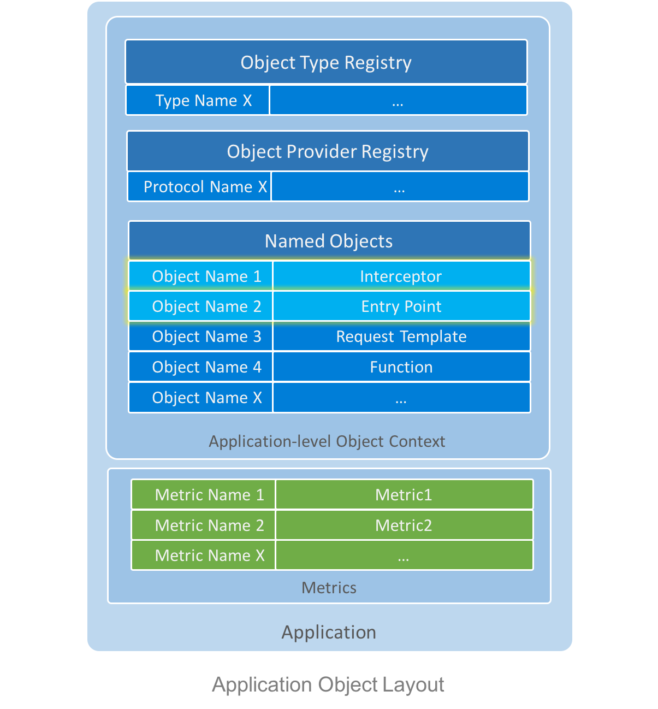

# Application

**Application** is an entity that exposes a list of logical related service methods, and manages resources to execute them.  

From deployment perspective, application is developed and distributed as a NPM module, with an `app.json` (see [schema](../../schema/application-config.schema.json)) at its root directory.

Programmingly, an application is a container that holds
- An application-level [object context](./object-context.md) as a container for application object types, object providers, and a collection of named objects. In particular, named objects [**Interceptor**](#interceptors) and [**EntryPoint**](#entry-points) create the execution stack for request processing.
- A collection of `Metric` for application level monitoring



## Request Execution
Based on **Interceptor** and **Entry Point**, an application execution stack is implemented for routing requests and execute them.

When serving a request, execution is planned as a stack of interceptors. Each interceptor can shortcircuit the request or relay to the next interceptor. Stacking interceptors allow us to apply policies like authentication, logging, request pre-processing and response post-processing in a flexible and reusable way. 


Unless specified explicitly at per entry point level, all entry points use a default execution stack specified by property *"defaultExecutionStack"* from `host.json` (see [schema](../../schema/host-config.schema.json)), which can be overriden from the same property defined in  `app.json`. 

The default execution stack is set as:
```json
{
    "defaultExecutionStack": [
        "finalizeResponse",
        "executeEntryPoint"
    ]
}
```
`finalizeResponse` and `executeEntryPoint` here are [built-in interceptors](../../config/builtin-interceptors.json). Users can also register their own interceptors, see [Interceptor Registration](#interceptor-registration).

Worthy noting, entry point is executed by interceptor `executeEntryPoint`, which should always be put at the bottom of execution stack.

Execution stack can also be specified per entry point by property *"executionStack"* under entry point configuration. Following is an example:
```json
{
    "name": "bar",
    "value": {
        "_type": "EntryPoint",
        "moduleName": "./test-app",
        "functionName": "entrypoints.bar",
        "executionStack": [
            "logRequestResponse",
            "finalizeResponse",
            "executeEntryPoint"
        ]
    }
}
```

### Interceptors

Interceptor is an function that receives a request, executes some logics upon the request, and return a response. It can relay request processing to other interceptors. 

Its programming interface `Interceptor` is defined as: 

```ts
export type Interceptor = (context: RequestContext) => Promise<wire.Response>;
```

 To allow interceptor overriding at runtime, interceptors are managed as [Named Objects](./object-context#named-object), thus they can be referenced by name from execution stack definition.


#### Implementing an Interceptor
An interceptor can either shortcircuit the execution by returning a Promise of `Response`: 

```ts
/// <summary> Interceptor: short circuit. 
/// This interceptor is used for debug purpose when doing per-request override
/// <summary> 
export async function shortCircuit(
    context: app.RequestContext): Promise<wire.Response> {
    return Promise.resolve({
        responseCode: wire.ResponseCode.Success
    });
}
```

Or relay request execution to the next interceptor:
```ts
/// <summary> Interceptor: pass through.
/// This interceptor is used for debug purpose when doing per-request override
/// <summary> 
export async function passThrough(
    context: app.RequestContext): Promise<wire.Response> {
    return await context.continueExecution();
}
```

#### <a name="interceptor-registration"></a> Registration

Being managed as a named object, interceptor can be defined and overriden at all levels from [Host](./host.md) to [Request](./request.md).

Following JSON element shows an example to register an interceptor.
```json
{
    "name": "passThrough",
    "description": "Interceptor to pass through current interception. ",
    "value": {
        "_type": "Interceptor",
        "moduleName": "../lib/builtin-interceptors",
        "functionName": "passThrough"
    }
}
```
After registration, `passThrough` can be referenced in execution stack.
#### Built-in Interceptors
Winery.js introduced a few  built-in interceptors to support common execution flow:

| Interceptor name     | Description                                         |
|----------------------|-----------------------------------------------------|
| executeEntryPoint  | Locate and call entry point and return response  |
| finalizeResponse   | Fill *"debugInfo"* and *"perfInfo*" in response|
| passThrough        | Pass through to the next interceptor                    |
| shortCircuit       | Shortcircuit with a dummy succeeded response        |
| logRequest         | Log request                                       |
| logResponse        | Log response                                      |
| logRequestResponse | Log both request and response                   |

### Entry Points

Entry Point is a function exposed to user as service method. Entry point has a name, which can be matched against property *"entrypoint"* from [Request](./request.md) to serve the request.

Its programming interface `EntryPoint` is defined as:
```ts
export type EntryPoint = (requestContext?: RequestContext, input?: any) => any;
```
Entry point can be a synchronous function or an asynchrnous function. When it's a synchrounous function, `Host.serve` will return a resolved Promise of its return type.

User can use `requestContext` to create objects or retrieve named objects that can be overriden at various levels.
#### Developing Entry Points

##### Writing an Entry Point Function
Following example shows how to implements a synchronous `EntryPoint`:

filename: `./test.ts`
```ts
export function sum(context: RequestContext, input: number[]): number{
    const s = 0;
    for (const num of input) {
        s += num;
    }
    return s;
}
```

##### <a name="entrypoint-registration"></a>Registration
Create a file named `entrypoints.json` (can be any name), and put the file name under property *"namedObjects"* from `app.json`. And put following content in `entrypoints.json`:
```ts
[
    {
        "name": "sum",
        "description": "Sum a list of numbers.",
        "value": {
            "_type": "EntryPoint",
            "moduleName": "./test",
            "functionName": "sum",
            "displayRank": 900,
            "exampleRequests": [
                {
                    "application": "example",
                    "entryPoint": "sum"
                }
            ]
        }
    }
]

```
##### Trying a Request
Then you can send a sample request by calling `Host.serve` with your request object:

*Sample request*:
```json
{
    "application": "example",
    "entryPoint": "sum",
    "input": [1, 2, 3]
}
```

*Expected response*:
```json
{
    "responseCode": 0,
    "output": 6
}
```
#### Built-in Entry Points
Winery.js introduced a few [built-in entry points](../../config/builtin-entrypoints.json) which bring common functionalities for all applications, such as entry point discovery, named object lookup, etc.

| Entry point name  | Description                                             |
|-------------------|---------------------------------------------------------|
| listApplication | List all applications served by current host            |
| listEntryPoints | List all entry points for an application                |
| listNamedObjects| List all public `NamedObject`                           |
| listTypes       | List all registered types for an application            |
| listProviders   | List all registered object providers for an application |
| getNamedObject  | Get a named object definition by name                   |
| getType         | Get an object type definition by type name              |
| getProvider     | Get an object provider definition by protocol name      |
## Application-level Resources
Besides modeling request execution, resources such as parameters, data model, etc. are also important for serving requests. Not only data resoures, behaviors such as object creation are also regarded as resources.

There is no special design to deal with resources in application, it all depends on **Object Context** to manage both data and behaviorial resources. If you are not familiar with the these concept, you should read [object context specification](./object-context.md) first.

#### Object Types
Application-level object types can be configured under property *"objectTypes"* in `app.json`.
```json
{
    "objectTypes": [
        "./object-types1.json",
        "./object-types2.json"
    ]
}
```
Each element under *"objectTypes"* is a file name which is created following the guide of  [object type registration](./object-context.md#object-type-registration).

At runtime, you can create objects of these types following [this instruction](./object-context.md#object-type-usage).

#### Object Providers
Application-level object providers can be configured under property *"objectProviders"* in `app.json`.
```json
{
    "objectProviders": [
        "./object-providers1.json",
        "./object-providers2.json"
    ]
}
```
Each element under *"objectProviders"* is a file name which is created following the guide of  [object provider registration](./object-context.md#object-provider-registration).

At runtime, you can create objects from URI following [this instruction](./object-context.md#object-provider-usage).

#### Named Objects

Application-level named objects can be configured under property *"namedObjects"* in `app.json`.
```json
{
    "namedObjects": [
        "./interceptors.json",
        "./entrypoints.json",
        "./resources.json"
    ]
}
```
Each element under *"namedObjects"* is a file name which is created following the guide for  [named object registration](./object-context.md#object-provider-registration). 

Please be aware that the interceptors, entrypoints, and other resources are all named objects, you can define them in different JSON file for better manageability, but it's not mandatory. 

At runtime, you can access named objects following [this instruction](./object-context.md#named-object-usage).

## Monitoring
Monitoring is a vital part of service experimentation. Therefore, Winery.js has built-in support for [`Metric`](https://github.com/Microsoft/napajs/blob/master/docs/api/metric.md#cpp-metric) objects exposed from [Napa.js](https://github.com/Microsoft/napajs). 


### <a name="metric-registration"></a> Registration
Each application can add dozens of `Metric` objects by registering them via property *"metrics"* in `app.json`.
```json
{
    "metrics": {
        "sectionName": "<metric-section-name>",
        "definition": [
            "./metric-collection1.json",
            "./metric-collection2.json"
        ]
    }
}
```
Property *"sectionName"* is used as section name to create every `Metric` object, it's specified at application level assuming that all metrics under the same application shall use the same section name. Thus different applications can have the same metric name but different section name to avoid confliction.

Each JSON file under property *"definition"* shall declare an array of objects which are conformed with [the schema of Metric definition](../../schema/metric-config.schema.json). 

E.g, following JSON element defines a `Metric` named *"requestRate"* of `Rate` type (among `Rate`, `Number` and `Percentile`), whose display name is *"Request Rate"*. 

```json
[
    {
        "name": "requestRate",
        "type": "Rate",
        "displayName": "Request Rate",
        "description": "Request rate",
        "dimensionNames": [
            "application", 
            "entryPoint"]
     }
]
```
 This metric has 2 dimensions: application name and entry point name, which means different application name or entry point name will be accounted separately.
### Accessing Metrics

 Metric can be retrieved at runtime by `requestContext.metric['<metric-name>']` or `application.metric['<metric-name>']`.

Following code increment the metric *"requestRate"* on instance *"example.sum"*.
 ```ts
context.metric['requestRate'].increment(["example", "sum"]);
 ```