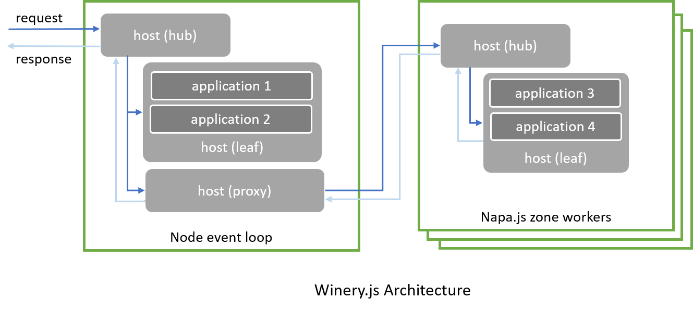

# Host
`Host` is an abstraction to host applications and serve user requests. Its interface is defined in [`lib/host.ts`](../../lib/host.md) as:

```ts
/// <summary> Interface for application host. </summary>
export interface Host {
    /// <summary> Register an application instance in current host. </summary>
    /// <param name="appModulePath"> full module path of a winery application.</param>
    /// <param name="appInstanceNames"> a list of strings used as names of application instances.</param>
    /// <param name="zone"> zone to run the app. If undefined, use current isolate. </param>
    register(
        appModulePath: string, 
        appInstanceNames: string[], 
        zone: napa.zone.Zone): Promise<void>;

    /// <summary> Serve a request. </summary>
    /// <param name="request"> A JSON string or a request object. </param>
    serve(request: string | wire.Request): Promise<wire.Response>;

    /// <summary> Get application instance names served by this host. </param>
    applicationInstanceNames: string[];
}
```

### Application Registration
A `Host` can host multiple `Application`s at the same time, each `Application` can be registered with multiple instance names or aliases. Decoupling application instance name from applicaton module name gives us the flexibility to switch modules without impacting user inputs, since instance name will be used as the key to dispatch `Request` to the right application, which is specified by property *`application`* from `Request`.

To support computation intensive scenarios, `Host` supports dispatching requests to another JavaScripts thread via [Napa zones](https://github.com/Microsoft/napajs/blob/master/docs/api/zone.md#intro). Thus there are three types of `Host` underlying to federate `Request` among multiple JavaScript threads.

There are three types of `Host`:
- **Leaf host**: host application in current JavaScript thread.
- **Host proxy**: route requests to remote JavaScript thread (zone worker)
- **Host hub**: route request among leaf host and proxies.

The diagram below depicts their collaborations.



Users don't have to interact with concrte `Host` types, when calling `winery()`, it returns a `Host hub` that can be used to register applications in both local thread or remote Napa zones.

Here is an examples to register multiple applications served in multiple zones.

```typescript
import napa = require('napajs');
import winery = require('winery');

// By using multiple container, we can define different runtime policies.
// Create container1 with default settings.
var zone1 = napa.zone.create('zone1');

// Create container2 with customized settings.
var zone2 = napa.zone.create('zone2', {
        workers: 4,
        maxStackSize: 1048576,      // 1 MB
        maxOldSpaceSize: 33554432,  // 32 MB
        maxSemiSpaceSize: 33554432, // 32 MB
    });

try {
    // Serve an io-intensive-app in Node.JS eventloop.
    await winery.register('io-intensive-app', ['example1']);

    // Serve example-app2 using name 'example2' and example-app3 using name 'example3a' in zone1. 
    await winery.register('example-app2', ['example2'], zone1);
    await winery.register('example-app3', ['example3a'], zone1);

    // Serve example-app3 using name 'example3b' and example-app4 using name 'example4' in zone2. 
    await winery.register('example-app3', ['example3b'], zone2);
    await winery.register('example-app4', ['example4'], zone2);
}
catch (e) {
    console.log("winery register failed:" + e);
}

```
### Request Serving
With application registered, request serving is straightforward:
```ts

// Create a request.
var request: winery.Request = {
    application: 'example1',
    entrypoint: 'echo',
    input: 'hello, world'
};

// Get a response.
var response: winery.Response = await winery.serve(request);
console.log(response);

```