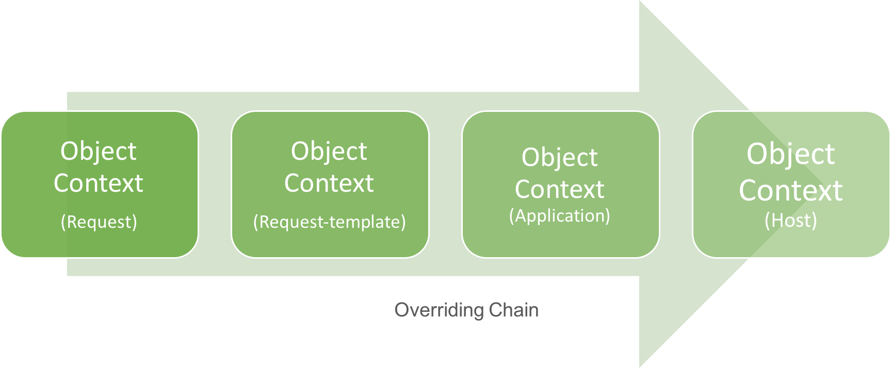

# Object Context

`ObjectContext` is an abstraction to encapsulate behaviors for object creation and object retrieval at runtime. Its interface is defined in [`../lib/object-context.ts`](../../lib/object-context.ts) as following:

```ts
/// <summary> Interface for ObjectContext </summary>
export interface ObjectContext {
    /// <summary> Create an object from input. </summary>
    /// <param name="input"> Input JS value. </param>
    /// <returns> Created object or null if failed. </returns>
    create(input: any): any;

    /// <summary> Get an named object from current context. </summary>
    /// <param name="name"> Name. case-sensitive. </param>
    /// <returns> Named object, or undefined if not found. </returns>
    get(name: string): NamedObject;

    /// <summary> Iterate each object on current context. Overriden object will only be visited once from higher scope. </summary>
    /// <param name="callback"> Callback on each named object. </summary>
    forEach(callback: (object: NamedObject) => void): void;

    /// <summary> Return the base directory of this object context. 
    /// User can use this directory to resolve files with relative paths.
    /// </summary>
    baseDir: string;
}
```
`ObjectContext` can be chained to form an override relationship, that child context can inherit/override behaviors from its parent. 

By chaining all runtime entities together, from `Request`,  `RequestTemplate` to `Application` and `Host`, users can override behaviors for object creation and retrieval at any of these 4 levels.



## Object Creation
Winery.js provides two ways for object creation, one is to construct an object from a plain JavaScript object input, the other is to create an object from a URI.

### From plain JavaScript object
- For primitive types, method `ObjectContext.create` simply pass through their values.

- For object-type input, a string property *"_type"* is required, which will be used as a key to look up constructor (or factory method) for creating the object.

An example input may look like:
```ts
const input = {
    _type: "Point",
    x: 1, 
    y: 2
}
```
#### Factory Method
The object definition and factory method may be defined as:

```ts
export class Point2D {
    public x: number;
    public y: number;
    constructor(x: number, y: number) {
        this.x = x;
        this.y = y;
    }

    public distance(pt: Point2D): number {
        return Math.sqrt(
            Math.pow(this.x - pt.x) 
            + Math.pow(this.y - pt.y));
    }
}

// Factory method (or constructor) function for Point2D
export function createPoint(input: any): Point2D {
    return new Point(input.x, input.y);
}
```
#### <a name="object-type-registration"></a>Registration
To associate *Point* from property `"_type"` with constructor `createPoint`, a type registration is required in JSON (see [schema](../../schema/object-type-config.schema.json) or interface [TypeDefinition](../../lib/object-type.ts)). 

It can be configured at `Host` and `Application` level by JSON files referenced in property *objectTypes* in [Host Config]() and [Application Config]().  or get overriden at `RequestTemplate` and `Request` level by elements under property *overrideTypes*.

The registration entry for *Point* shall look like:
```json
{
    "typeName": "Point",
    "description": "Constructor for Point2D.",
    "moduleName": "point2d",
    "functionName": "createPoint",
    "exampleObjects": [
        {
            "_type": "Point",
            "x": 0,
            "y": 1
        }
    ]
}

```
You can also check out [registration for built-in types](../../config/builtin-types.json).

#### <a name="object-type-usage"></a>Usage
Following code creates two `Point2D` objects at runtime and print their distance:
```ts
import {ObjectContext} from 'winery'

function doSomething(context: ObjectContext): void {
   const pt1: Point2D = context.create({ _type: "Point", x: 0, y: 0});
   const pt2: Point2D = context.create({ _type: "Point", x: 1, y: 1});
   console.log(pt1.distance(pt2));
}
```
Please note that you should always use `ObjectContext` to create the objects instead of `new` it directly if you want to override the object creation behavior later.

### From URI
In many cases, it's beneficial to describe an object using an URI, like "file://abc.txt", or "http://www.something.com/a", and etc. Therefore, Winery.js also supports creating an object from an [URI](../../lib/object-provider.ts).

It's very similar to creating objects from plain objects, except that the input is just a string in the format of an URI.

#### Provider Method
For example, if we are going to support creation of `Point2D` from URI: *"pt:/?x=1&y=2"*, we can do:
```ts
import {Uri} from "winery";

// Provider function for Point2D.
export createPoint2DFromURI(uri: Uri) {
    const x = parseFloat(uri.getParameter('x'));
    const y = parseFloat(uri.getParameter('y'));
    return new Point2D(x, y);
}
```
#### <a name="object-provider-registration"></a> Registration
Following JSON object (see [schema](../../schema/object-provider-config.schema.json) or interface [ProviderDefinition](../../lib/object-provider.ts)) registers `createPoint2DFromURI` as the provider function for protocol *"pt"*: 
```json
{
    "protocol": "pt",
    "description": "Point2D",
    "moduleName": "point2d",
    "functionName": "createPoint2DFromURI",
    "exampleUri": [
        "pt:/?x=0&y=0"
    ]
}
```
Similarly, provider methods can be registered at `Host` and `Application` level in files referenced by property *"objectProviders"*, or get overriden at `RequestTemplate` and `Request` level in elements of property *"overrideProviders"*.

#### <a name="object-provider-usage"></a> Usage
To create Point2D from URIs at runtime:
```ts
function doSomething(context: ObjectContext): void {
   const pt1: Point2D = context.create("pt:/?x=0&y=0");
   const pt2: Point2D = context.create("pt:/?x=1&y=1");
   console.log(pt1.distance(pt2));
}
```

## Object Retrieval
How to retrive an existing object is another dimension of the problem. Winery.js supports this functionality via `NamedObject`, which is an object associated with a global unique name.

### Named Object
`NamedObject` is created from `NamedObjectDefinition`, while `NamedObjectDefinition` can be specified from a plain JavaScript object or from JSON. 

Both of them are defined in [`./lib/named-object.ts`](../../lib/named-object.ts):
```ts
export interface NamedObjectDefinition {
    /// <summary> Name or key to retrieve this object. </summary>
    name: string;

    /// <summary> Description for this object. </summary>
    description?: string;

    /// <summary> If this object is private, means that cannot be listed by entry points `listNamedObjects`. </summary>
    private?: boolean;

    /// <summary> If this object overrides a previous object definition with the same name. 
    /// This may be useful if you borrow definition file from other apps and want to override individual ones.
    /// </summary>
    override?: boolean;

    /// <summary> Value of the input to create this named object, which is described by plain JavaScript object or URI.
    /// The plain JavaScript object / URI can be constructed by registered ObjectFactory and ObjectProvider.
    /// </summary>
    value: any;

    /// <summary> Dependency from current definition to object context. This is calculated automatically.</summary>
    dependencies?: ObjectContextDependency;
}

export interface NamedObject {
    /// <summary> Definition of current named object. </summary>
    definition: NamedObjectDefinition;

    /// <summary> Value of current named object </summary>
    value: any;
    
    /// <summary> Scope of where this named object is provided. </summary>
    readonly scope: string;
}
```
### <a name="named-object-registration"></a> Registration
A JSON object below conforms to the [schema](../../schema/named-object-config.schema.json) of `NamedObjectDefinition`, which registers a `Point2D` object with name *"CenterOfUniverse"*:
```json
{
    "name": "CenterOfUniverse",
    "value": {
        "_type": "Point",
        "x": 0,
        "y": 1
    }
}
```
The same as [`ObjectTypes`](#from-plain-javascript-object) and [`ObjectProviders`](#from-uri), `NamedObject` can be registered at `Host` and `Application` level by files under property *"namedObjects"*, or get overriden at `RequestTemplate` and `Request` level by carrying the new definition under property *"overrideObjects"*. 


### <a name="named-object-usage"></a> Usage
Following code demostrates the retrival of this pre-defined object at runtime. 
```ts
function doSomething(context: ObjectContext): void {
   const center: Point2D = context.get("CenterOfUniverse").value;

   console.log(center);
}
```
