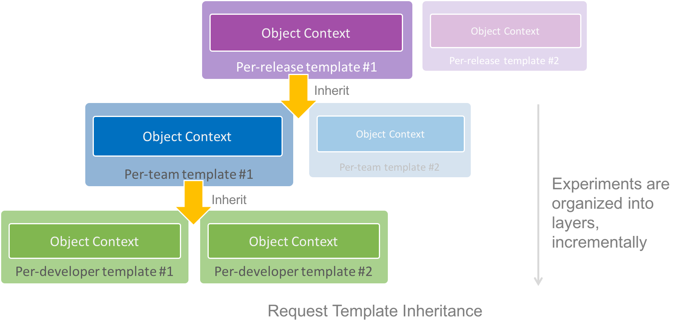

# Request Template

**Request Template** is an object that pre-configure resources for serving requests. Multiple request templates can be loaded in memory on the same host, thus they can be used for serving the same requests with different server-side treatment. One common usage is for A/B testing. Objects declared in request template are loaded when request template is loaded, thus there is no performance impact during request serving time.

## Template-level Resources
Users can define [Object Context](./object-context.md) at template level, which overrides object context at application level and host level.

The elements to define template-level object context are the same as those in [Request](./request.md). They are:

| Property name     | Required | Description                                                                                                              |
|-------------------|----------|--------------------------------------------------------------------------------------------------------------------------|
| overrideTypes     | N        | override constructor of objects created [from plain JavaScript object](./object-context.md#from-plain-javascript-object) |
| overrideProviders | N        | override provider of objects created [from URI](./object-context.md#from-uri)                                            |
| overrideObjects   | N        | override [named objects](./object-context.md#named-object)                                                               |


## Template Inheritance
A request template can extend another request template, which inherits the Object Context from its base, and can override with its own (see [Overriding Rule](./object-context.md#overriding-rule)). Request object can be thought as a finalized request template during request time, which comes with an overhead of creating its resources per request.

Template inheritance enables a structured development process to manage changes layer by layer incrementally, as well as sharing resources among multiple templates.



## Example

Following JSON file defines a request template  extending a base template, with overriden object types, providers and named objects.
```json
{
    "base": "rt://base-template",
    "overrideTypes": [
        {
            "typeName": "Type1",
            "moduleName": "module1",
            "functionName": "function1"
        }
    ],
    "overrideProviders": [
        {
            "protocol": "protocol1",
            "moduleName": "module1",
            "functionName": "function2"
        }
    ],
    "overrideObjects": [
        {
            "name": "object1",
            "value": {
                "someProp": "someValue"
            }
        }
    ]
}
```